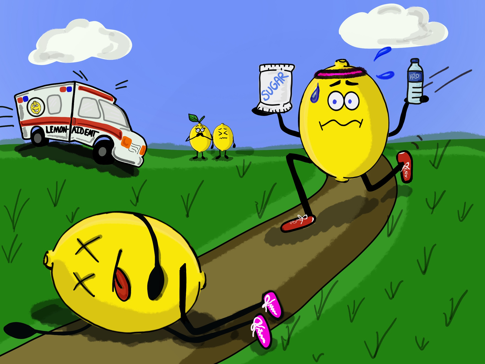

# My First Coding Assignment

## About Me
I am enrolled in the Web Design & Communication graduate program at UFL. In my free time, I enjoy traveling, being outdoors, creating digital art, and hanging out with my rescue dog.

## Past Coding Experience
I've dabbled in courses from Codecademy - mainly in HTML and CSS

## Career Goals
1. UX Designer
2. Web Designer
3. Mixture of both with graphic design sprinkled in
